## Racket QA Email Feature

Racket-QA Email component provides functionality to send out a unit test result to a mailing list. It is best used when combined with the [Test Scheduler][Scheduler Document] to notify the result of a scheduled test run-up to a group of developers involved. You can also use it with the [Test-Capture utility][Test-Capture Document] to send out the result of a manual test run-up. It does not provide an option for you to compose an email of your own. Instead, you can create mailing lists using its UI and associate it with the test suite when you run or schedule a unit test using the aforementioned utilities.

### How to use mailing list UI

There are 3 different ways you can start the mailing list UI.

1. It can be launched from the [Test-Capture utility][Test-Capture Document] when you manually execute a unit test and want to send out the test result to a mailing list.
2. It can be launched from the [Test Scheduler utility][Scheduler Document] when you schedule an automated test and wish the test result to be sent out to a mailing list at the time of the scheduled run-up.
3. It can be launched from the main Racket-QA UI to create, delete, or modify a mailing list for a later use in the above two cases.

Mailing list UI launched from Test-Capture utility
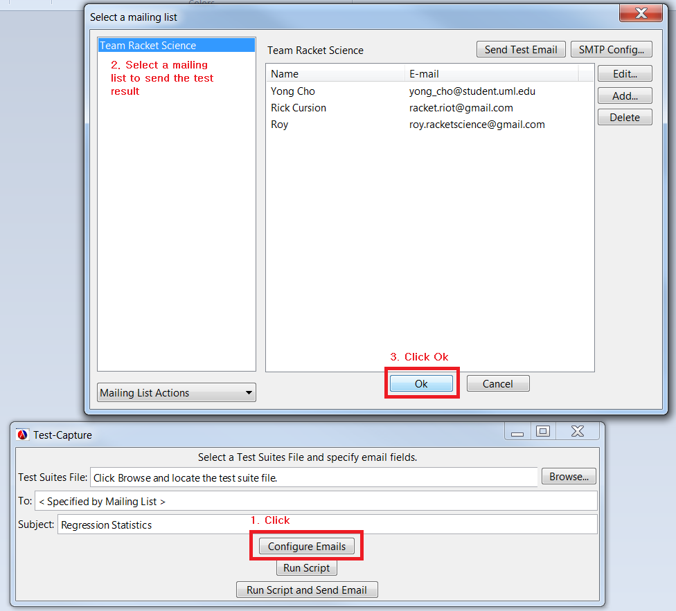

Mailing list UI launched from Test Scheduler utility
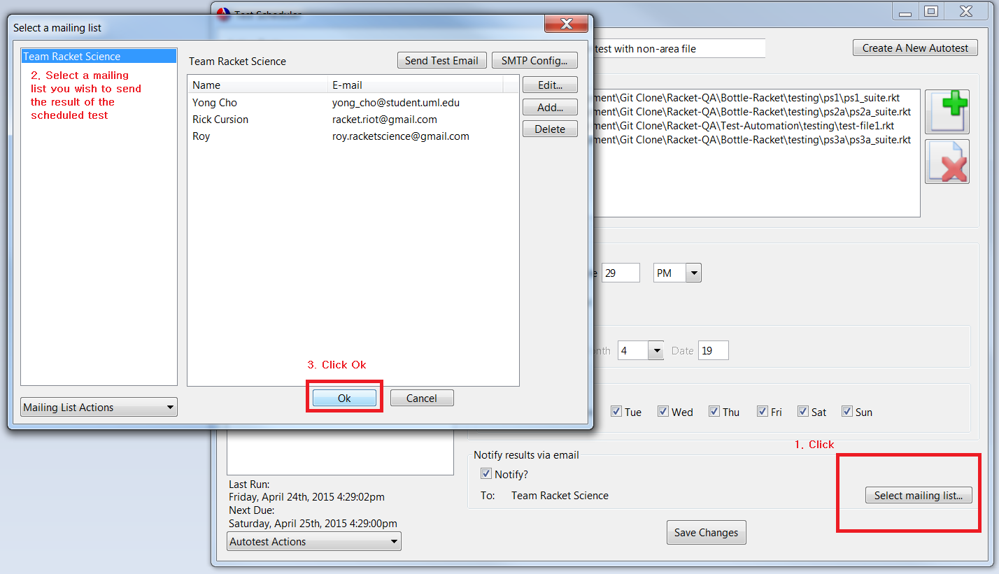

Mailing list UI launched from the main Racket-QA UI
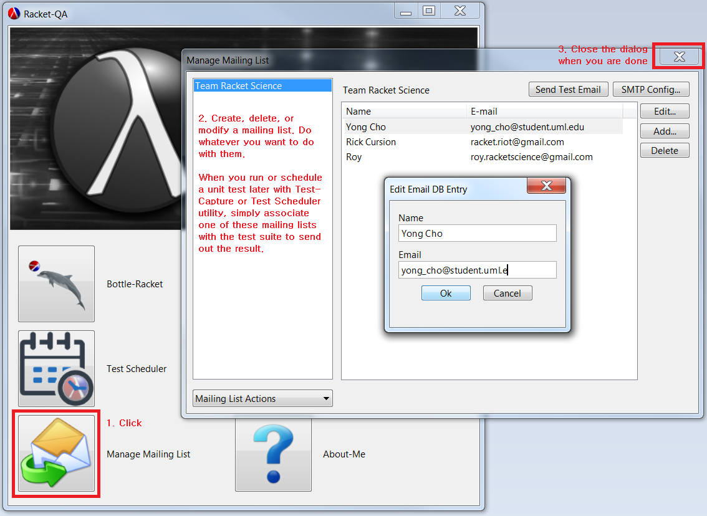

You can use the drop-down box on the bottom left corner to create a new mailing list or delete an existing one.
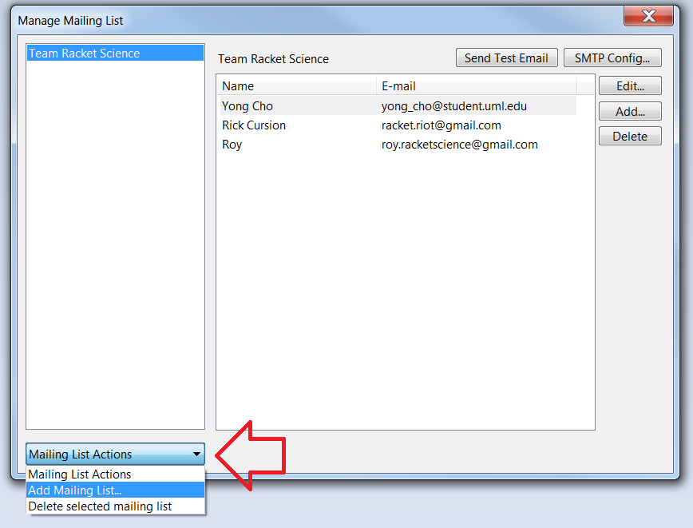

Provide a name for the new mailing list.
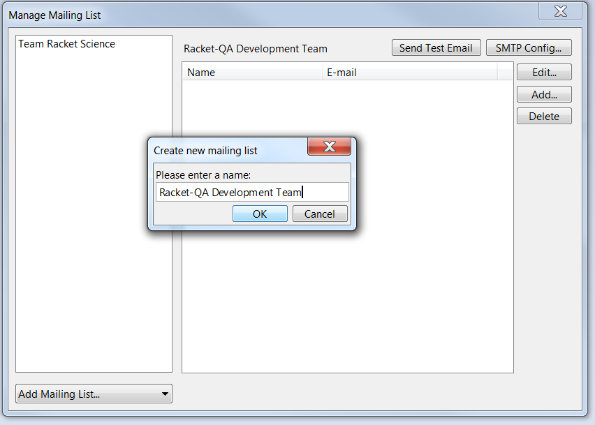

You have created a new mailing list. Let's add some email addresses to it.
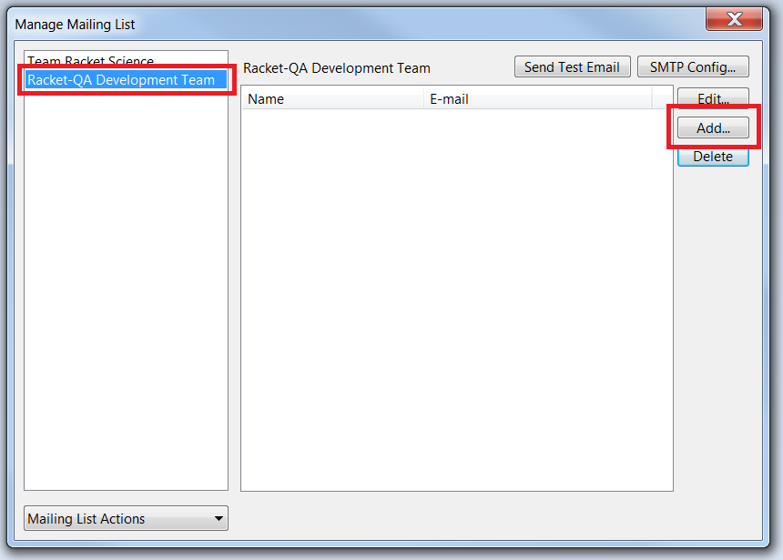
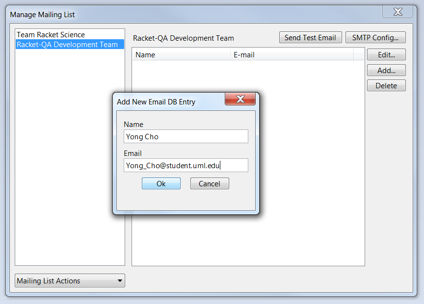
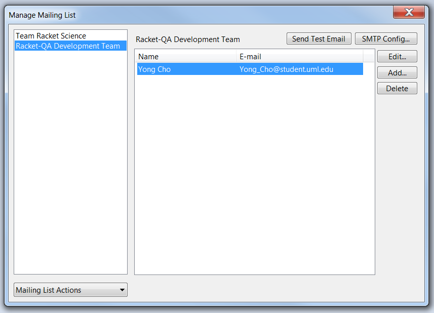

QA-Email does not have its own mail server. In order to send out an email, it relies on your own email account. You can click the "SMTP Config" button to provide an SMTP information for your email account. This is the same information you would normally need on email clients like Thunderbird or Outlook. Here, we have created a gmail account for demo.
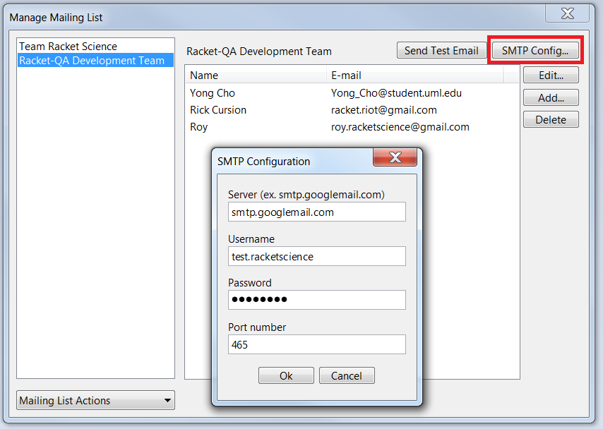
Note: Enter the SMTP information only on a trusted computer because it will be stored on the machine.

If you have opened the mailing list UI through either Test-Capture or Test Scheduler utility, you will see an Ok and Cancel button in the bottom. When you select one of the mailing lists on the left side and click Ok, the Test-Capture or Test Scheduler utility will see this mailing list and use it to send out the test results.
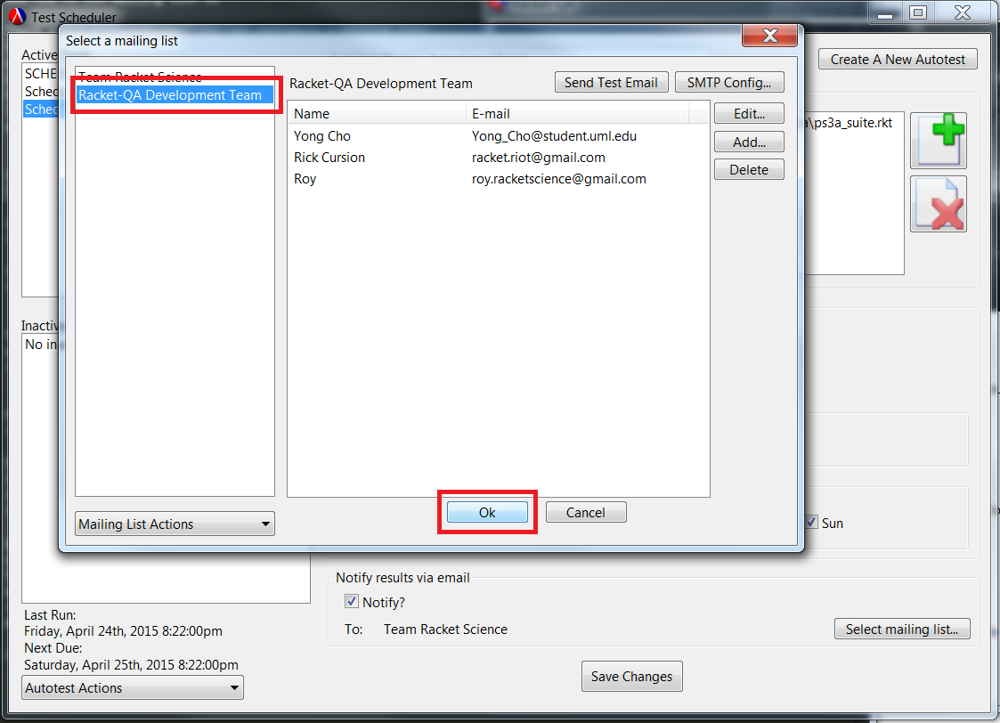

If you have opened the UI from the main Racket-QA UI, you won't see the Ok and Cancel buttons. You can use this to pre-configure your mailing lists so you can use them later with Test-Capture or Test Scheduler.

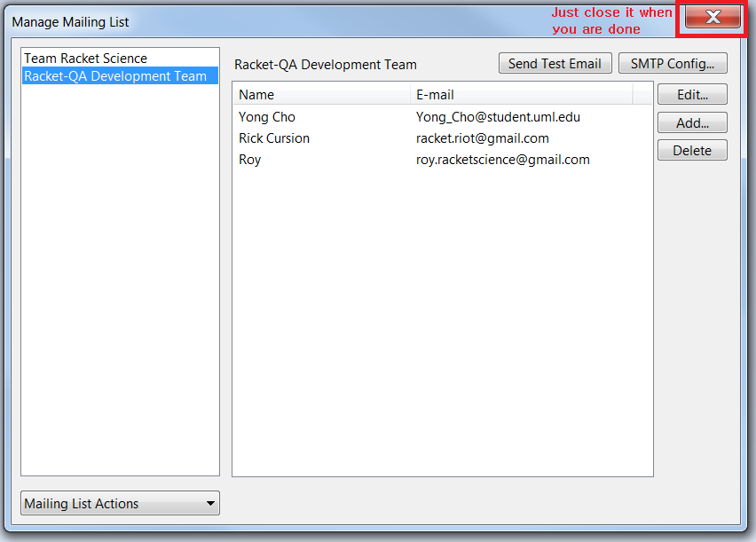

Now you know how to manage mailing lists on Racket-QA. You can go ahead and run a unit test with Test-Capture utility or schedule an overnight test with Test Scheduler and have the results mailed to your dev team (or yourself). You can click the links below to learn how to use Test-Capture and Test Scheduler.

[Test-Capture utility][Test-Capture Document]  
[Test Scheduler utility][Scheduler Document]

<!-- Links -->
[Test-Capture Document]: https://github.com/oplS15projects/Racket-QA/blob/master/Bottle-Racket/README.md
[Scheduler Document]: https://github.com/oplS15projects/Racket-QA/blob/master/Test-Automation/readme.md
